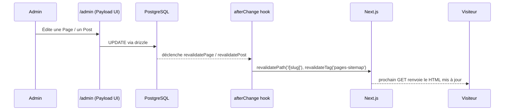
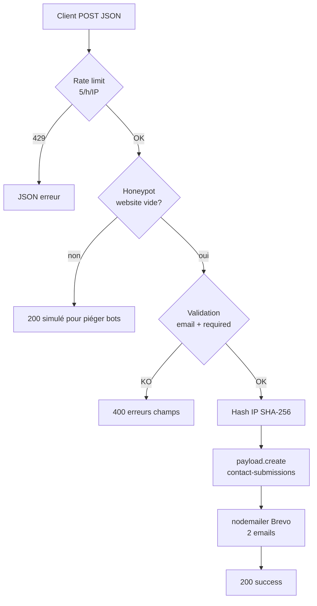

# Flux de données

Cartographie des chemins que prennent les données du CMS jusqu'à la page rendue : build time, runtime, revalidation, live preview.

## Vue synthétique

## Pages statiques (aucune donnée CMS)

Les pages suivantes sont **SSG pures** : leur contenu est écrit en dur dans le TSX et ne dépend pas de Payload.

- `/` — [[homepage]]
- `/services` — [[services]]
- `/a-propos` — [[a-propos]]
- `/portfolio` — [[portfolio]]
- `/contact` — [[contact]] (le formulaire côté client pousse vers l'API)
- `/mentions-legales` — [[mentions-legales]]
- `/confidentialite` — [[confidentialite]]

Ces pages ne sont régénérées qu'au **build** (`pnpm build`). Toute modification éditoriale demande un nouveau déploiement Docker.

## Pages CMS (layout builder)

Toute route `/[slug]` inconnue est résolue par `src/app/(frontend)/[slug]/page.tsx`. Le flux est :

1. `generateStaticParams` liste tous les `pages.slug` publiés (build time).
2. `page.tsx` fait `payload.find({ collection: 'pages', where: { slug, _status: 'published' } })`.
3. Le document Pages contient un champ `hero` (rendu par `RenderHero`) et un tableau `layout` de blocks → rendu par `RenderBlocks` (voir [[collections/pages]]).
4. En mode preview (draft), la page passe `draft: true` à Payload et le composant `LivePreviewListener` écoute les changements via `@payloadcms/live-preview-react`.

Revalidation côté Next.js déclenchée par le hook [[collections/pages#hooks|revalidatePage]] : `revalidatePath(/${slug})` + `revalidateTag('pages-sitemap')` sur `afterChange` et `afterDelete`.

## Blog (posts)

Deux modes cohabitent :

- **Archive** (`/posts` et `/posts/page/[pageNumber]`) — `dynamic = 'force-static'` + `revalidate = 600` (ISR 10 min). `generateStaticParams` pré-rend les N premières pages.
- **Détail** (`/posts/[slug]`) — SSG via `generateStaticParams` sur tous les posts publiés. Revalidé par [[collections/posts#hooks|revalidatePost]].

Le champ `content` est un éditeur Lexical qui contient des blocks inline (`Banner`, `Code`, `MediaBlock`) rendus côté serveur.

Les auteurs sont enrichis par le hook `afterRead` `populateAuthors` qui expose `populatedAuthors` (id + name uniquement, jamais le document complet — privacy by design).

## Formulaire de contact

Flux complet du POST `/api/contact` (voir `src/app/api/contact/route.ts`) :

Persistance : collection [[collections/contact-submissions]] avec groupe `consent` (preuve RGPD Art. 7). Rétention 24 mois appliquée par la task [[workflows/mettre-a-jour-le-contenu|purgeOldSubmissions]].

## Globals Header et Footer

- Chargés à chaque rendu via `getCachedGlobal('header', 1)` / `getCachedGlobal('footer', 1)` → utilise la couche de cache Next.js.
- Invalidés par les hooks `revalidateHeader` et `revalidateFooter` quand l'admin modifie l'un ou l'autre.
- Voir [[globals/header]] et [[globals/footer]].

## Cache et revalidation — résumé

| Mécanisme | Déclencheur | Effet |
|-----------|-------------|-------|
| `revalidatePath` | Hook `afterChange` / `afterDelete` collection | Purge le HTML pré-rendu de la route |
| `revalidateTag` | Idem (tags `pages-sitemap`, `posts-sitemap`) | Purge les sitemaps XML dynamiques |
| ISR `revalidate: 600` | Route `/posts` et pagination | Rafraîchit au plus toutes les 10 min |
| Live Preview | Session `/admin` en mode preview | Push via websocket Payload, rendu client temps réel |
| Cron Coolify | `POST /api/payload-jobs/run` | Déclenche `purgeOldSubmissions` |

## Liens connexes

- [[overview]] — vue d'ensemble.
- [[payload-config]] — configuration du cache et des jobs.
- [[variables-environnement]] — `PREVIEW_SECRET`, `CRON_SECRET`.
