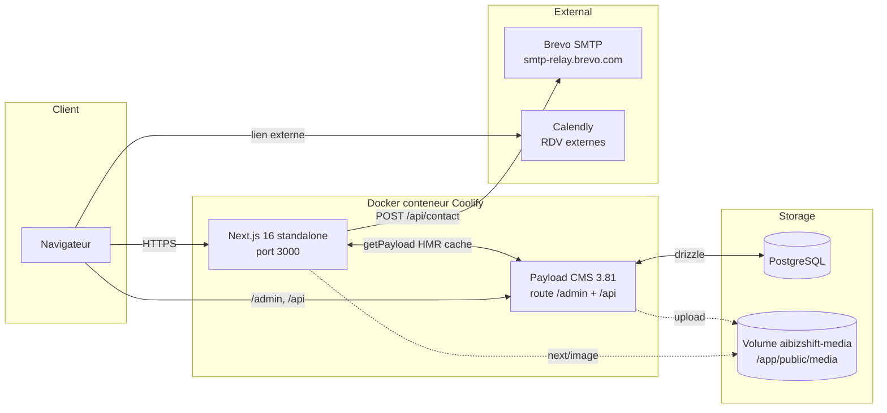

# Vue d'ensemble

AIBizShift est un site vitrine hybride **Next.js 16 (App Router) + Payload CMS 3.81** déployé en conteneur Docker sur Coolify (serveur souverain français). Le front mélange des pages statiques codées en dur (homepage, services, à propos, portfolio, pages légales) et des pages dynamiques pilotées par Payload (blog, layout builder, search). La base de données est **PostgreSQL**, les assets média sont stockés sur un volume persistant.

## Schéma global

## Composants majeurs

- **Frontend** (`src/app/(frontend)/`) : pages statiques + routes dynamiques `[slug]`, `posts`, `search`, sitemaps XML. Voir [[routes]].
- **Backend CMS** (`src/app/(payload)/`) : admin Payload, API REST, GraphQL, GraphQL Playground.
- **API métier** (`src/app/api/contact/route.ts`) : endpoint POST du formulaire `/contact` avec rate limit, honeypot, persistance et notification SMTP. Voir [[contact]].
- **Jobs** : task `purgeOldSubmissions` déclenchée par un cron Coolify quotidien. Voir [[hebergement]].

## Flux de requête type

1. Le navigateur demande `/services` → Next.js sert la page **SSG** pré-rendue au build.
2. Pour `/posts/<slug>` → page générée par `generateStaticParams` + ISR revalidate 600 s.
3. Pour `/[slug]` CMS → Next.js appelle `payload.find({ collection: 'pages', where: { slug } })` et rend `RenderHero` + `RenderBlocks`.
4. Toute soumission CMS déclenche un hook `revalidatePage` qui purge le cache Next.js via `revalidatePath` / `revalidateTag`.

## Liens connexes

- [[stack-technique]] — versions exactes et choix techniques.
- [[flux-de-donnees]] — détail build vs runtime, cache, revalidation.
- [[payload-config]] — configuration globale du CMS.
- [[hebergement]] — plateforme Coolify, volume, cron.
