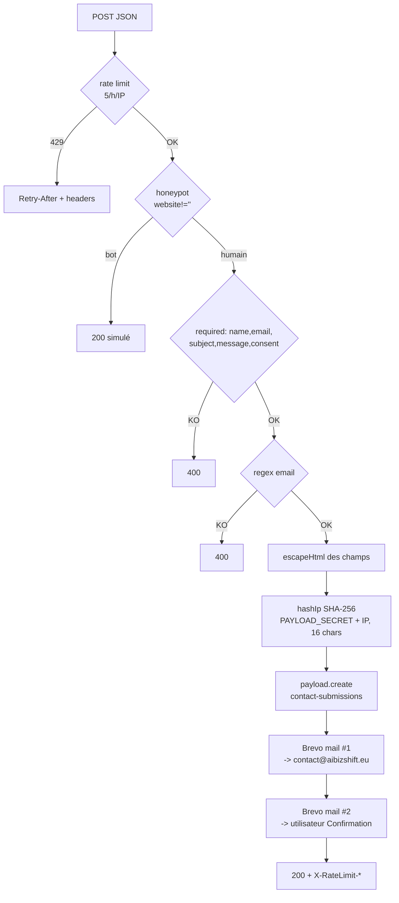

# Contact

Source page : `src/app/(frontend)/contact/page.tsx`. Source API : `src/app/api/contact/route.ts`. Composant formulaire : `src/components/ContactForm.tsx`.

## Métadonnées

- `title` : `Contact — AIBizShift | Consultant IA & Automatisation | Valence, Drôme`
- `description` : formulaire, prise de RDV, audit gratuit, réponse sous 24h.

## Structure page

### Hero

- Titre : "Parlons de votre projet".
- Pitch : formulaire ou créneau Calendly de 30 min.

### Grille principale

- **Colonne gauche** (3/5) : `<ContactForm />` (voir [[ContactForm]]).
- **Colonne droite** (2/5) :
  - **Bloc Calendly** : CTA "Réserver un créneau".
  - **Bloc Coordonnées** : email `contact@aibizshift.eu`, Portes-lès-Valence (Drôme), "Interventions France entière", liens LinkedIn + Malt.
  - **Bloc Audit gratuit** : CTA secondaire vers Calendly.

## API `/api/contact`

Route custom `src/app/api/contact/route.ts` (POST JSON). Pipeline :



### Rate limit

- Clé : `contact:${ip}`
- Fenêtre : 60 min
- Max : 5 requêtes
- Réponse 429 : headers `Retry-After`, `X-RateLimit-Limit`, `X-RateLimit-Remaining: 0`, `X-RateLimit-Reset`.

### Honeypot

Champ caché `website` dans le formulaire. Si rempli, retour 200 immédiat (leurre pour les bots).

### Validation

- `name`, `email`, `subject`, `message`, `consent` : tous requis.
- `email` : regex `/^[^\s@]+@[^\s@]+\.[^\s@]+$/`.

### Hash IP

```typescript
function hashIp(ip: string): string {
  return createHash('sha256').update(`${IP_HASH_SALT}:${ip}`).digest('hex').slice(0, 16)
}
```

`IP_HASH_SALT` = `process.env.PAYLOAD_SECRET || 'aibizshift-fallback-salt'`. Tronqué à 16 chars — pseudonymisation RGPD Art. 32.

### Persistance

`payload.create({ collection: 'contact-submissions', data: { ..., consent: { given: true, givenAt, ipHash } } })`. Voir [[collections/contact-submissions]].

### Emails (Brevo via nodemailer)

Transport recréé à chaque requête — la config Payload n'est **pas** réutilisée ici :

```typescript
const transporter = nodemailer.createTransport({
  host: process.env.SMTP_HOST,
  port,
  secure,  // port 465 → true, sinon false; SMTP_SECURE=false force false
  auth: { user: process.env.SMTP_USER, pass: process.env.SMTP_PASS },
})
```

Deux mails :

1. **Interne** → `SMTP_FROM || SMTP_USER`, `replyTo: email`, sujet `[AIBizShift] ${subject} — ${name}`, HTML table des champs.
2. **Utilisateur** → `email`, sujet `Bien reçu ! — AIBizShift`, confirmation + CTA Calendly + mention Data Privacy Framework + lien `/confidentialite`.

### Sécurité

- `escapeHtml` sur tous les champs injectés dans le HTML.
- Logs limités (code d'erreur sans PII).
- Pas de `tls.rejectUnauthorized: false` (correctif sécurité 2026-04-17).

## Calendly

URL unique : `https://calendly.com/guy-salvatore/30min`. Utilisée partout sur le site via la constante `CALENDLY_URL`.

## Variables d'environnement utilisées

- `PAYLOAD_SECRET` — sel du hash IP.
- `SMTP_HOST`, `SMTP_PORT`, `SMTP_SECURE`, `SMTP_USER`, `SMTP_PASS`, `SMTP_FROM`.

Voir [[variables-environnement]].

## Liens connexes

- [[ContactForm]] — composant React client.
- [[collections/contact-submissions]] — persistance + purge 24 mois.
- [[confidentialite]] — politique RGPD référencée dans le mail de confirmation.
- [[payload-config]] — transport SMTP Payload (utilisé pour l'admin, mais pas cette route).
